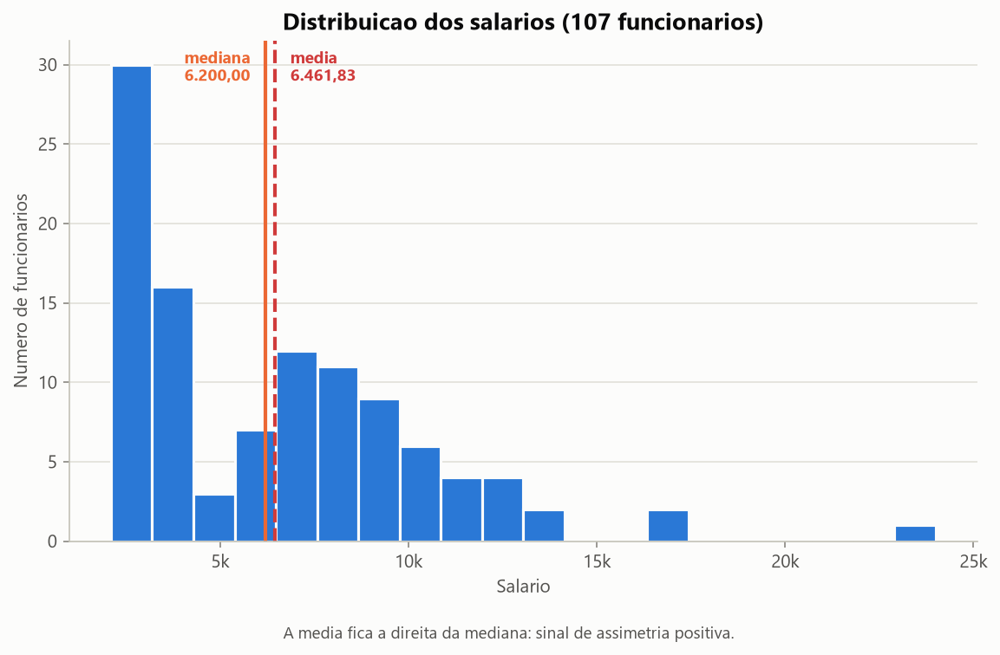
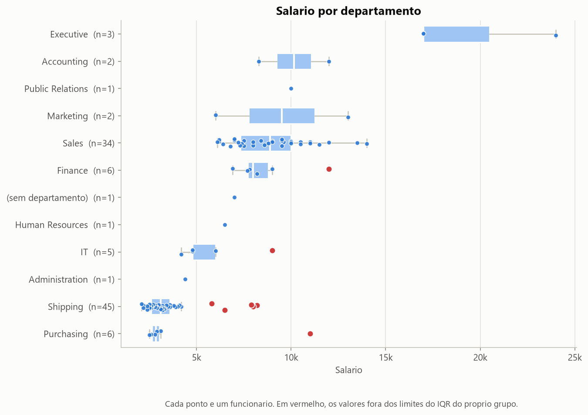
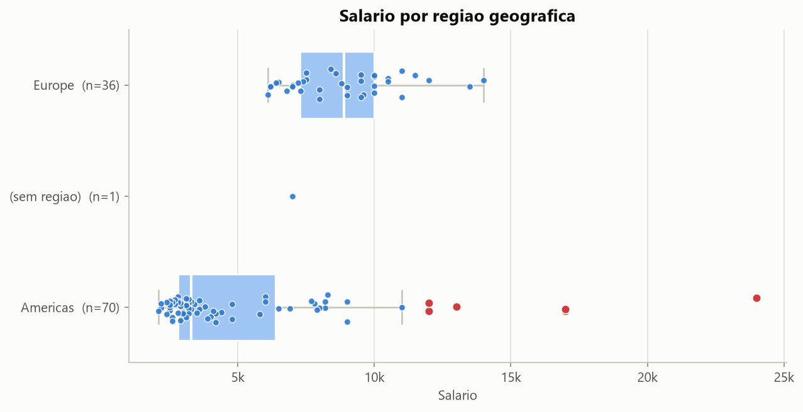
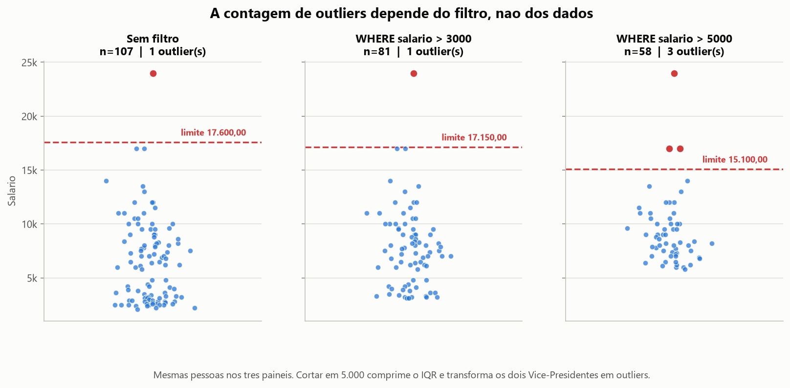
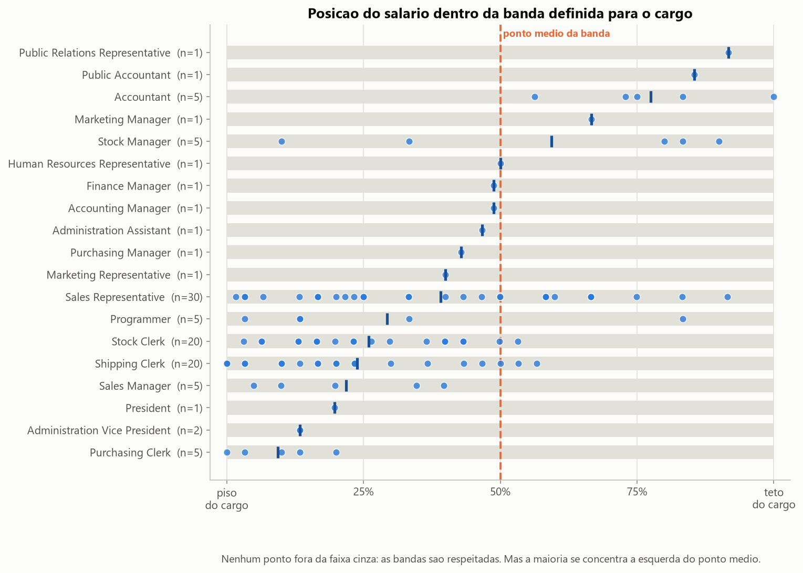

# Análise Exploratória da Estrutura Salarial e Distribuição Geográfica — Esquema HR

**Aluno:** Leo Gobel
**Turma:** Visualização de Dados e Business Intelligence — T2
**Módulo:** 1 — Projeto Avaliativo (Semana 13)

Projeto de análise de dados de Recursos Humanos: extração via SQL no
**FreeSQL** (Esquema HR), exportação dos resultados para
CSV, e Análise Exploratória de Dados (AED) em Python com estatística descritiva
e visualizações.

### 🎥 Vídeo de apresentação

<!-- COLE O LINK DO VÍDEO ABAIXO, substituindo a linha em itálico -->

_Link do vídeo será adicionado aqui após a gravação._

---

## 1. Objetivo do trabalho

A equipe de RH precisa entender como os salários estão distribuídos na empresa —
por departamento, por cargo e por região — para apoiar decisões de remuneração,
especialmente na definição de faixas salariais para novas contratações.

Este projeto responde a três perguntas:

1. Como os salários se distribuem entre departamentos e cargos?
2. Existe diferença de remuneração entre as regiões onde a empresa opera?
3. Os salários praticados estão coerentes com as faixas que a própria empresa
   definiu para cada cargo?

A terceira pergunta é a que sustenta a recomendação final sobre novas
contratações.


## 2. As tabelas usadas

O esquema HR descreve uma empresa através de sete tabelas. Seis são usadas aqui:

| Tabela | O que guarda | Papel na análise |
|---|---|---|
| `EMPLOYEES` | 107 funcionários: nome, salário, comissão, data de admissão, cargo, gestor e departamento | Tabela central — toda consulta parte dela |
| `DEPARTMENTS` | 27 setores e o local onde funcionam | Dá o nome do setor e a ponte para a geografia |
| `JOBS` | 19 cargos com **faixa salarial** (`MIN_SALARY` e `MAX_SALARY`) | Permite comparar o salário com a banda do cargo |
| `LOCATIONS` | 23 escritórios: endereço, cidade, estado | Cidade e estado do funcionário |
| `COUNTRIES` | 25 países | País |
| `REGIONS` | 4 macro-regiões | Região (Americas, Europe, Asia, Middle East and Africa) |

A sétima tabela, `HR.JOB_HISTORY` (cargos anteriores), existe no esquema mas não
é usada nas consultas — ela aparece nas sugestões de melhorias futuras.

**Detalhe importante da modelagem:** o funcionário não tem endereço próprio. A
localização dele vem do departamento onde trabalha, através da cadeia
`EMPLOYEES → DEPARTMENTS → LOCATIONS → COUNTRIES → REGIONS`. Quem não tem
departamento, não tem geografia.


## 3. As duas consultas SQL

As duas consultas foram escritas e executadas no **[SQL Worksheet]** do FreeSQL. 
Duas particularidades do dialeto Oracle afetaram a escrita:

- **Concatenação usa `||`.** O `CONCAT` do Oracle aceita apenas dois argumentos,
  então `CONCAT(FIRST_NAME, ' ', LAST_NAME)` não funciona — daí
  `FIRST_NAME || ' ' || LAST_NAME`.
- **`TO_CHAR(HIRE_DATE, 'YYYY-MM-DD')`** força a data para o formato ISO. Sem
  isso o CSV sairia como `07-JUN-12`, que o pandas não interpreta direto.

### Query 1 — Salário por departamento e cargo.

Três `LEFT JOIN`: `DEPARTMENTS` (setor), `JOBS` (cargo e faixa salarial) e um
**auto-relacionamento** com `EMPLOYEES` para trazer o nome do gestor direto.
Além do salário, traz `MIN_SALARY`, `MAX_SALARY` e `COMMISSION_PCT` — as colunas
que tornam possíveis as análises dos Blocos 7 e 8.

### Query 2 — Funcionários por região

Quatro `LEFT JOIN` percorrendo toda a cadeia geográfica: `DEPARTMENTS`,
`LOCATIONS`, `COUNTRIES` e `REGIONS`.

### Por que `LEFT JOIN` e não `INNER JOIN`

O funcionário **178 (Kimberely Grant)** não tem departamento cadastrado. Como a
localização depende do departamento, ele também fica sem cidade, país e região.

Com `INNER JOIN` esse registro sumiria das duas consultas **sem nenhum aviso** — a
folha de pagamento ficaria incompleta e ninguém perceberia. O `LEFT JOIN` mantém
os 107 funcionários e deixa os campos como `NULL`, tornando a falha de cadastro
visível. É por isso que a Query 2 retorna 107 linhas, mas apenas 106 têm região
preenchida: **a diferença entre esses dois números é um achado, não um erro.**

### Por que o filtro é `WHERE SALARY IS NOT NULL`

O enunciado sugeria filtros como `WHERE SALARY > 5000` ou
`WHERE DEPARTMENT_ID IS NOT NULL`. Ambos foram descartados de forma deliberada:

- `DEPARTMENT_ID IS NOT NULL` eliminaria exatamente o registro que justifica o uso
  do `LEFT JOIN`.
- `SALARY > X` aplicaria um corte **na própria variável que o projeto estuda**.
  Isso trunca a cauda inferior da distribuição, comprime o IQR e **altera a
  contagem de outliers** — demonstrado com números no Bloco 6.

O filtro adotado cumpre a exigência da cláusula `WHERE`, garante integridade da
métrica e preserva os 107 funcionários.


## 4. A análise em Python

`src/analise.py` está organizado em **8 blocos**:

| Bloco | O que faz |

| 1 | Carga dos CSVs, tipos, nulos, duplicatas e verificação de integridade |
| 2 | Estatística descritiva: média, mediana, mínimo, máximo, desvio, quartis |
| 3 | Distribuição e assimetria → **histograma** |
| 4 | Comparação por departamento → **boxplot** |
| 5 | Comparação por região → **boxplot** |
| 6 | Outliers pelo método IQR e **o efeito do filtro sobre a contagem** |
| 7 | Conformidade de banda salarial (compa-ratio) |
| 8 | Remuneração total incluindo comissão |

O pipeline é separado em duas etapas: a **extração** acontece no SQL Worksheet do
FreeSQL (consulta → `Download > CSV`) e a **análise** acontece no Python, lendo
esses CSVs. Assim os dados brutos ficam versionados no repositório e a análise
pode ser reexecutada quantas vezes for preciso sem depender do banco.

## 5. Principais resultados

### 5.1 A distribuição é assimétrica à direita



| Medida | Valor |

| Funcionários | 107 |
| Folha total | 691.416,00 |
| **Média** | **6.461,83** |
| **Mediana** | **6.200,00** |
| **Mínimo** | **2.100,00** |
| **Máximo** | **24.000,00** |
| Desvio padrão | 3.909,58 |
| Q1 / Q3 | 3.100,00 / 8.900,00 |
| IQR | 5.800,00 |
| Coeficiente de variação | 60,5% |
| Assimetria (skew) | 1,321 |

A média supera a mediana em 4,2% e o *skew* (distorção) de 1,32 confirma a assimetria
positiva. Quase metade da empresa (43 pessoas) ganha até 4.000.

**Consequência prática:** para descrever o funcionário típico, a medida correta é
a **mediana**. A média descreve o custo médio da folha, não uma pessoa real.

### 5.2 A diferença entre departamentos chega a 6x



| Departamento | n | Mediana |

| Executive | 3 | 17.000,00 |
| Accounting | 2 | 10.154,00 |
| Sales | 34 | 8.900,00 |
| Finance | 6 | 8.000,00 |
| IT | 5 | 4.800,00 |
| Shipping | 45 | 3.100,00 |
| Purchasing | 6 | 2.850,00 |

Executive tem mediana **6,0x** maior que Purchasing. Shipping concentra **45 dos
107 funcionários** (42% da empresa) na faixa mais baixa — é ele que puxa a
mediana geral para baixo e cria a forma assimétrica do histograma.

### 5.3 A diferença regional é ilusória



| Região | n | Mediana |

| Europe | 36 | 8.900,00 |
| Americas | 70 | 3.300,00 |
| *(sem região)* | 1 | 7.000,00 |

À primeira vista a Europa paga quase **3x mais** que as Américas. Mas o cruzamento
com o Bloco 4 mostra que isso **não é geografia, é composição de cargos**:

- **Europe** abriga praticamente só o departamento de Sales (34 dos 36), em Oxford.
- **Americas** abriga os 45 funcionários de Shipping, em South San Francisco.

Não existem duas regiões pagando diferente pelo mesmo trabalho — existem duas
regiões fazendo trabalhos diferentes. Comparar salário por região sem controlar
por cargo produziria uma conclusão falsa.

Outro achado estrutural: a empresa mantém **23 escritórios cadastrados em 4
regiões**, mas só tem gente alocada em **2 regiões e 5 cidades**. A maior parte das
localidades está cadastrada e vazia — algo que só aparece porque a consulta parte
de `EMPLOYEES`, e não de `LOCATIONS`.

### 5.4 A contagem de outliers depende do filtro, não dos dados



Pelo método do IQR sobre a base completa, existe **1 outlier**: Steven King
(President), com 24.000. Os dois Vice-Presidentes, com 17.000, ficam logo abaixo
do limite de 17.600.

Mas o resultado muda conforme o filtro aplicado na consulta SQL:

| Cenário | n | IQR | Limite superior | Outliers |

| Sem filtro | 107 | 5.800,00 | 17.600,00 | **1** |
| `WHERE salario > 3000` | 81 | 5.100,00 | 17.150,00 | 1 |
| `WHERE salario > 5000` | 58 | **3.150,00** | **15.100,00** | **3** |

Cortar em 5.000 remove a cauda inferior, **comprime o IQR em 46%** e derruba o
limite superior de 17.600 para 15.100 — fazendo os dois Vice-Presidentes "virarem"
outliers. Eles não mudaram de salário; mudou a régua.

**É por isso que o filtro escolhido não corta salário.** A quantidade de outliers
só é interpretável sobre a distribuição completa.

Quanto à natureza deles: os valores extremos são cargos de direção. Não são erro
de digitação nem fraude — são a camada executiva. Removê-los eliminaria justamente
a hierarquia que a análise quer descrever.

### 5.5 As bandas são respeitadas — mas a empresa opera no piso delas



A tabela `JOBS` define uma faixa (`MIN_SALARY` a `MAX_SALARY`) para cada cargo.
Comparando o salário real com essa faixa:

- **Nenhum funcionário está fora da banda do próprio cargo.** Zero violações.
- Mas **80 dos 107 (74,8%) estão abaixo do ponto médio** da própria banda.
- **Compa-ratio médio da empresa: 0,88** — indicador clássico de RH, onde 1,00
  significa pagar exatamente o ponto médio da faixa.

Ou seja: as faixas são formalmente cumpridas, mas a empresa opera de forma
sistemática no terço inferior das faixas que ela mesma definiu. Purchasing
estão em média na posição **0,09** — praticamente no piso.

**E aqui a leitura dos outliers se inverte.** Steven King ganha 24.000 e é o único
outlier estatístico da empresa. Mas a banda do cargo de President vai de 20.080 a
40.000: ele está na **posição 0,20** da própria faixa, **abaixo do ponto médio**
(compa-ratio 0,80). Em contraste, Daniel Faviet (Accountant) ganha 9.000, não
aparece como outlier em lugar nenhum — e está **exatamente no teto** do cargo dele.

O "outlier" é um artefato de comparar cargos que têm faixas diferentes.
Normalizando pela banda, quem parecia extremo passa a ser modestamente remunerado
para a função que exerce.

### 5.6 A comissão muda a comparação entre departamentos

35 dos 107 funcionários recebem comissão — **todos em Sales**, com média de 22,3%.
Incluindo a comissão, a mediana de Sales sobe de 8.900 para **10.962,50 (+23%)**,
enquanto nenhum outro departamento se move.

Comparar departamentos apenas pelo salário-base subestima Sales de forma
sistemática.

---

## 6. Como executar o projeto

### Pré-requisitos

- Python 3.10 ou superior
- Conta gratuita no [FreeSQL](https://freesql.com/)
- Git

### Passo 1 — Clonar e instalar as dependências

```bash
git clone https://github.com/gobels2/Projeto-Avaliativo-Modulo-1-SCTEC.git

Acesse a pasta
cd projeto-final-hr

pip install -r requirements.txt
```

### Passo 2 — Acessar o esquema HR no FreeSQL

O FreeSQL é um ambiente acessado pelo navegador. O
esquema HR já vem carregado — não é preciso criar nem popular nada.

1. Acesse [freesql.com](https://freesql.com/) e faça login
2. No painel **Navigator**, à esquerda, abra a lista de esquemas
3. Selecione **Human Resources (HR)**
4. As 7 tabelas aparecem listadas: `HR.COUNTRIES`, `HR.DEPARTMENTS`,
   `HR.EMPLOYEES`, `HR.JOBS`, `HR.JOB_HISTORY`, `HR.LOCATIONS`, `HR.REGIONS`

### Passo 3 — Executar as consultas e exportar os CSVs

Para **cada** uma das duas consultas:

1. Abra o arquivo `sql/query_01.sql` e copie o comando `SELECT`
2. Cole no painel **[SQL Worksheet]**
3. Execute (botão ▷ *Run Statement* ou `Ctrl+Enter`)
4. No painel **Query result**, clique em **Download > CSV**
5. Renomeie o arquivo baixado (`export.csv`) para `query_01.csv` e mova para a
   pasta `data/`

Repita com `sql/query_02.sql`, salvando como `data/query_02.csv`.

> **Confira:** cada CSV deve ter **108 linhas** — 1 de cabeçalho e 107 de dados.

Os dois CSVs já estão versionados no repositório, então é possível pular direto
para o Passo 4 e apenas reproduzir a análise.

### Passo 4 — Rodar a análise

```bash
python src/analise.py
```

Lê os dois CSVs, executa a análise exploratória em 8 blocos, gera os 5 gráficos
em `img/` e grava o relatório completo em `data/resultados.txt`.


## 7. Estrutura do repositório

```
projeto-final-hr/
├── sql/
│   ├── query_01.sql           # salário por departamento e cargo (3 LEFT JOIN)
│   └── query_02.sql           # funcionários por região (4 LEFT JOIN)
├── src/
│   └── analise.py             # AED em 8 blocos + geração dos gráficos
├── data/
│   ├── query_01.csv           # 107 linhas x 10 colunas — export do FreeSQL
│   ├── query_02.csv           # 107 linhas x 8 colunas  — export do FreeSQL
│   └── resultados.txt         # relatório completo da análise
├── img/                       # os 5 gráficos gerados
├── requirements.txt
└── README.md
```


## 8. Sugestões de melhoria para futuras versões

1. **Usar `JOB_HISTORY` para analisar progressão de carreira** — hoje a tabela é
   carregada mas não analisada. Ela permitiria medir tempo médio até promoção e
   se a mudança de cargo vem acompanhada de reposicionamento na banda.
2. **Cruzar tempo de casa (`HIRE_DATE`) com posição na banda** — a hipótese natural
   é que quem está há mais tempo ocupe posições mais altas. Se isso não se
   confirmar, há um problema de reajuste que a análise atual não captura.
3. **Controlar a comparação regional por cargo** — como mostrado em 5.3, comparar
   regiões sem controlar composição de cargos leva a conclusão errada. Uma
   comparação pareada (mesmo cargo, regiões diferentes) resolveria.
4. **Comparar as bandas com o mercado externo** — os dados dizem se a empresa
   respeita as próprias faixas, não se essas faixas são competitivas.
5. **Corrigir o cadastro do funcionário 178** — a análise expôs a falha; o passo
   seguinte é uma rotina de validação que impeça novos cadastros sem departamento.
6. **Dashboard interativo** (Power BI ou Streamlit) para o time de RH filtrar por
   cargo, região e faixa sem precisar rodar o script.


## 9. Tecnologias utilizadas

FreeSQL · Python 3.12 · pandas · NumPy · Matplotlib · Git e GitHub
